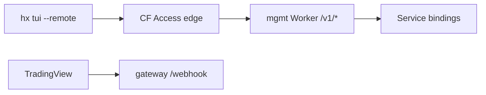

<!--
  Copyright (c) 2026 HOOX · jango-blockchained (hoox-sh)
  SPDX-License-Identifier: CC-BY-4.0
-->

---
title: "Private ingress (Access + Tunnel)"
description: "How to protect the Hoox operator management plane with Cloudflare Access and optional Cloudflare Tunnel."
---

# Private ingress for operators

The **operator management plane** (`/v1/*` — workers list, SSE streams, health probe) should not sit open on the public internet the way TradingView webhooks do.

| Surface | Hostname (recommended) | Auth |
| ------- | ---------------------- | ---- |
| Trading signals | `gateway.example.com` | Body `apiKey` + IP allowlist |
| Operator TUI / CLI | `mgmt.example.com` | Access (+ Bearer `OPERATOR_API_KEY`) |
| Dashboard UI | `app.example.com` | Access / SSO (existing) |

## When to use Access vs Tunnel vs mTLS

| Approach | Use when | Open core |
| -------- | -------- | --------- |
| **Cloudflare Access** (service token) | Default private operator path; free tier friendly | Yes |
| **Cloudflare Tunnel** (`cloudflared`) | Origin must not be public; self-hosted; strict network isolation | Docs + `hoox tunnel check` |
| **API Shield mTLS** | Device-bound client certs / compliance | Enterprise |

**Recommended default:** Access on `mgmt.example.com` + Bearer `HOOX_API_TOKEN` ↔ Worker `OPERATOR_API_KEY`.  
**Tunnel** is optional defense-in-depth (or required for private origins).  
**mTLS** stacks on top for Enterprise.



## Quick setup (Access only)

1. Map `mgmt.example.com` to the Worker that serves `/v1/*` (often the same script as the gateway **only if** path policies differ — prefer a separate hostname).
2. Zero Trust → Access → Applications → Self-hosted → `mgmt.example.com`.
3. Create a **service token** for automation; put values in the laptop env:

```bash
export CF_ACCESS_CLIENT_ID=…
export CF_ACCESS_CLIENT_SECRET=…
export HOOX_TRANSPORT=access   # or: hoox config transport set access
```

4. Set the application Bearer on the Worker and client:

```bash
wrangler secret put OPERATOR_API_KEY
export HOOX_API_TOKEN=…        # same value
```

5. Verify:

```bash
hoox doctor --security --api-url https://mgmt.example.com
hoox tunnel check --api-url https://mgmt.example.com --probe
hoox tui --remote --api-url https://mgmt.example.com
```

### Expected probe results

| Caller | Healthy outcome |
| ------ | --------------- |
| Anonymous `GET /v1/health` | `302` Access redirect or `401` (not `200`) |
| Authed (Bearer + Access headers) | `200` JSON `{ plane: "operator", … }` |

## Optional: Cloudflare Tunnel

Use a tunnel when the management origin must not be reachable on a public Worker URL, or when self-hosting behind a firewall.

1. Install CLI: [cloudflared downloads](https://developers.cloudflare.com/cloudflare-one/connections/connect-networks/downloads/)
2. `cloudflared tunnel create hoox-mgmt`
3. Route DNS `mgmt.example.com` → tunnel
4. Run the connector with a config that points at your origin (Worker via private path, or local `server.js`)
5. Put **Access** on the tunnel hostname
6. `hoox tunnel check` confirms the binary; `--probe` exercises `/v1/health`

```bash
hoox tunnel check
hoox tunnel check --api-url https://mgmt.example.com --probe
```

Tunnel does **not** replace `CLOUDFLARE_API_TOKEN` for deploy/secrets (control plane). It only protects **your** management API.

## CLI surface

| Command | Purpose |
| ------- | ------- |
| `hoox doctor --security` | Hygiene + optional probes |
| `hoox tunnel check` | cloudflared detect + optional probes |
| `hoox config transport` | Show resolved transport profile |
| `hoox config transport set access` | Persist preference to `~/.hoox/config.json` |
| `hoox tui --remote` | Fail-closed launch (Bearer or Access env) |

Env reference:

| Variable | Role |
| -------- | ---- |
| `HOOX_API_URL` | Management base URL |
| `HOOX_API_TOKEN` | Bearer → `OPERATOR_API_KEY` |
| `HOOX_TRANSPORT` | `public` \| `access` \| `mtls` \| `tunnel` |
| `CF_ACCESS_CLIENT_ID` / `SECRET` | Access service token |

## Align dashboard + management Access

Prefer one Access **policy group** (emails / GitHub team) for:

- Dashboard hostname (human SSO)
- Management hostname (service token for `hx`, SSO for browsers if any)

Device posture and SCIM remain Enterprise policy layers.

## Related

- [Zero Trust](/devops/deployment/zero-trust)
- [TUI architecture](/devops/tui)
- [Security overview](/devops/security/overview)
- Enterprise mTLS: `docs/enterprise/security-compliance.mdx`
