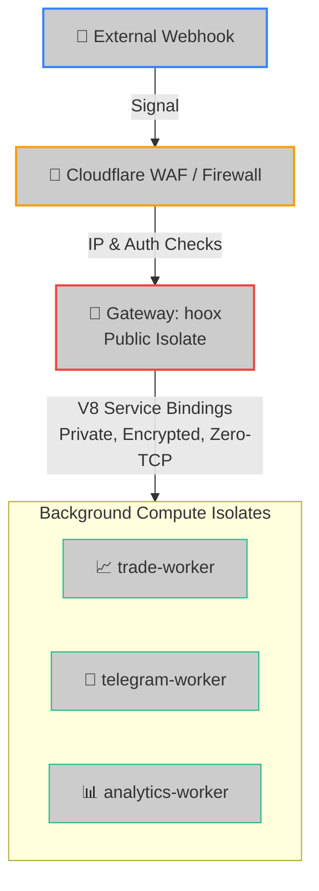

<!--
  Copyright (c) 2026 HOOX · jango-blockchained (hoox-sh)
  SPDX-License-Identifier: CC-BY-4.0
-->

---
title: "hoox Gateway Isolate Profile"
description: "Comprehensive engineering specification for the Hoox public gateway, covering ingress WAF rules, Durable Object idempotency stores, and Service Binding configurations."
---

The **`hoox`** gateway is the public-facing entry point of the trading ecosystem. Running as an ultra-low-latency Cloudflare Worker, the gateway is responsible for authorizing incoming trade signals (TradingView alerts, email routing, manual commands), executing rate-limiting checks, locking transaction trace IDs via Durable Objects to prevent duplicate fills, and routing validated events privately to background compute nodes.

---

## 🏗️ Architectural Topology



---

## ⚡ 1. Declared Wrangler Configurations & Bindings

The gateway's `wrangler.jsonc` defines its private service binding links and resource bounds:

```jsonc
{
  "name": "hoox",
  "main": "src/index.ts",
  "compatibility_date": "2026-05-19",
  "compatibility_flags": ["nodejs_compat"],
  "account_id": "debc6545e63bea36be059cbc82d80ec8",
  "placement": {
    "mode": "smart",
  },
  "vars": {
    "ENVIRONMENT": "production",
  },
  "kv_namespaces": [
    {
      "binding": "CONFIG_KV",
      "id": "c5917667a21745e390ff969f32b1847d",
    },
    {
      "binding": "SESSIONS_KV",
      "id": "ff70a58b492e45d79880a7a8213c745c",
    },
  ],
  "services": [
    { "binding": "TRADE_SERVICE", "service": "trade-worker" },
    { "binding": "TELEGRAM_SERVICE", "service": "telegram-worker" },
  ],
  "queues": {
    "producers": [{ "queue": "trade-execution", "binding": "TRADE_QUEUE" }],
  },
  "durable_objects": {
    "bindings": [
      { "name": "IDEMPOTENCY_STORE", "class_name": "IdempotencyStore" },
    ],
  },
  "migrations": [
    {
      "tag": "v1",
      "new_sqlite_classes": ["IdempotencyStore"],
    },
  ],
}
```

---

## 🔑 2. Environmental Variables & Encrypted Secrets

For security, build-time credentials are never stored in plain text. They are bound at deploy time as encrypted secrets:

- **`WEBHOOK_API_KEY_BINDING`**: The shared secret expected in the JSON body field `apiKey` on `POST /webhook` (and `POST /`). **Fail-closed** — if unset, all webhook requests return `403`.
- **`INTERNAL_KEY_BINDING`**: Shared service-to-service key sent as `X-Internal-Auth-Key` when calling trade-worker / telegram-worker.
- **`OPERATOR_API_KEY`** (preferred) or legacy **`INTERNAL_API_KEY`**: Bearer token for the operator management plane (`/v1/*`). Fail-closed when unset.

### Local Development Mocking (`.dev.vars`)

When running tests or starting local Wrangler dev, create a gitignored `.dev.vars` file in the gateway directory:

```bash
WEBHOOK_API_KEY_BINDING=dev_webhook_auth_passkey
INTERNAL_KEY_BINDING=dev_shared_internal_security_key
OPERATOR_API_KEY=dev_operator_bearer_token
```

---

## 🛡️ 2b. Ingress controls (WAF-layer)

Applied on the webhook critical path **before** dispatch:

| Control | Behavior |
| ------- | -------- |
| **Kill switch** | Reads `trade:kill_switch` **or** `global:kill_switch` from `CONFIG_KV`. Either set to a truthy value (`true` / `1` / `yes` / `on`) returns **`503`** with `code: "KILL_SWITCH"`. Agent / CLI write `trade:kill_switch`; gateway dashboard section uses `global:kill_switch`. |
| **IP allowlist** | When `webhook:tradingview:ip_check_enabled` is true (default), `CF-Connecting-IP` must be in the built-in TradingView set or `webhook:tradingview:allowed_ips` JSON array. Missing IP → `403`. |
| **Body size** | Hard cap **64 KiB** (Content-Length early reject + stream read). Oversized → `413`. |
| **Auth** | Body `apiKey` compared with `timingSafeEqual` against `WEBHOOK_API_KEY_BINDING`. Missing/invalid → `403` (no key material in responses). |
| **Rate limit** | KV-backed counter keyed by stable session (apiKey), default **10 req / 60s**. Exceeded → `429` `code: "RATE_LIMITED"`. |
| **Idempotency** | Durable Object `IdempotencyStore`. Prefers body `idempotencyKey` or `Idempotency-Key` header; otherwise auto fingerprint `trade:{exchange}:{symbol}:{action}:{quantity}:{live\|test}`. Duplicates → `409`. |

---

## 🛜 3. API Route Specifications

> **Note:** For the canonical endpoint directory with full request/response examples across all workers, see [`/docs/devops/api/endpoints`](../api/endpoints).

### A. Ingest Signal Webhook

- **Endpoints**: `POST /webhook` and `POST /` (alias)
- **Auth**: body `apiKey` + optional IP allowlist (see above)
- **JSON Payload**:
  ```json
  {
    "apiKey": "dev_webhook_auth_passkey",
    "exchange": "bybit",
    "action": "LONG",
    "symbol": "BTCUSDT",
    "quantity": 0.01,
    "leverage": 10,
    "test": true,
    "idempotencyKey": "uuid-9b1deb4d-3b7d"
  }
  ```
- **`test` (optional)**: forwarded to trade-worker / queue. Idempotency keys are mode-split (`…:live` vs `…:test`) so a live fill and a sandbox fill of the same size never dedupe each other. See [Test Trading](/enduser/guides/test-trading).
- **`idempotencyKey` (optional)**: client-supplied dedupe key (also accepted via `Idempotency-Key` header). Max 256 chars.
- **Success Response (200 OK)** — direct trade-worker path:
  ```json
  {
    "success": true,
    "requestId": "9b1deb4d-3b7d-4bad-9bdd-2b0d7b3dcb6d",
    "tradeResult": {
      "success": true,
      "requestId": "9b1deb4d-3b7d-4bad-9bdd-2b0d7b3dcb6d",
      "tradeResult": { "orderId": "18049284739", "status": "Filled" }
    },
    "notificationResult": null
  }
  ```
- **Queued Response (202 Accepted)** — `queue_everywhere` or failover after direct failure:
  ```json
  {
    "success": true,
    "requestId": "9b1deb4d-3b7d-4bad-9bdd-2b0d7b3dcb6d",
    "status": "Enqueued",
    "tradeResult": {
      "success": true,
      "requestId": "9b1deb4d-3b7d-4bad-9bdd-2b0d7b3dcb6d",
      "tradeResult": { "queued": true, "message": "Trade queued for execution" }
    }
  }
  ```

---

### B. Gateway Health Diagnostics

- **Endpoint**: `GET /health`
- **Auth**: none (liveness probe — no KV round-trips)
- **Success Response (200 OK)**:
  ```json
  {
    "success": true,
    "status": "ok",
    "timestamp": 1779261050000,
    "service": "hoox",
    "bindings": {
      "kv": "configured",
      "sessions": "configured",
      "queue": "configured",
      "trade": "configured",
      "telegram": "configured",
      "idempotency": "configured"
    }
  }
  ```

---

### C. Operator management plane (`/v1/*`)

Bearer `OPERATOR_API_KEY` (or legacy `INTERNAL_API_KEY`). Prefer Cloudflare Access on a dedicated mgmt hostname.

| Method | Path | Description |
| ------ | ---- | ----------- |
| `GET` | `/v1/health` | Operator plane liveness |
| `GET` | `/v1/workers` | Minimal gateway self-view (`WorkerInfo[]`) |
| `GET` | `/v1/trades/stream` | SSE stub (connected event) |
| `GET` | `/v1/logs/stream` | SSE stub (connected event) |
| `GET` | `/workers` | Legacy alias of `/v1/workers` |

---

<Tip>
  If exchange APIs experience high latency or go offline, the gateway intercepts
  the failure, serializes the payload, and pushes it to the `TRADE_QUEUE`
  producer (queue_failover mode), returning a `"status": "Enqueued"`
  (**202 Accepted**) response to TradingView.
</Tip>

### 🔗 Next Steps

- **[trade-worker Spec](trade-worker)** — Review how trade executions, order math, and margin settings compile on the edge.
- **[D1 Database Operations](../../enduser/guides/database-ops)** — Manage schema migrations, query ledgers, and execute SQL scripts.
